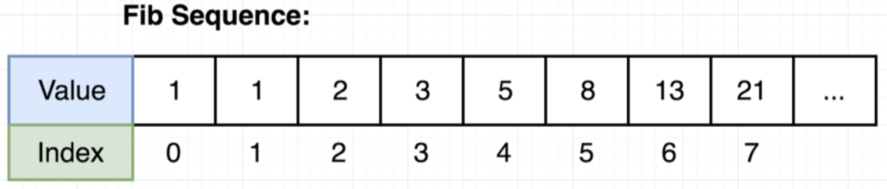
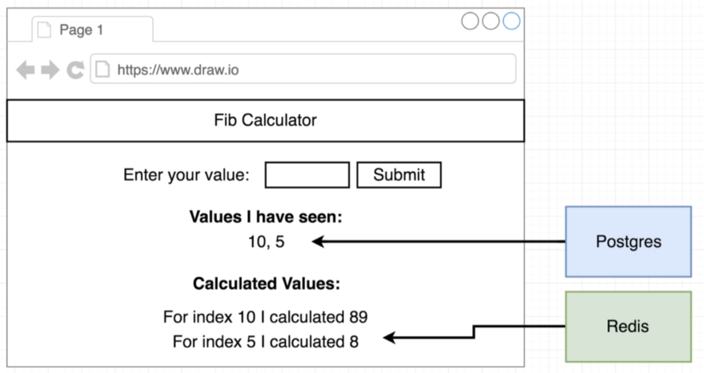
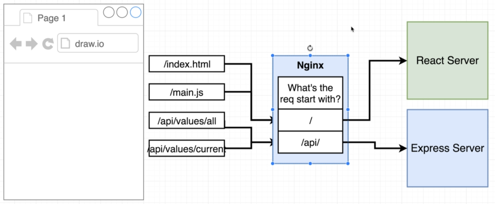
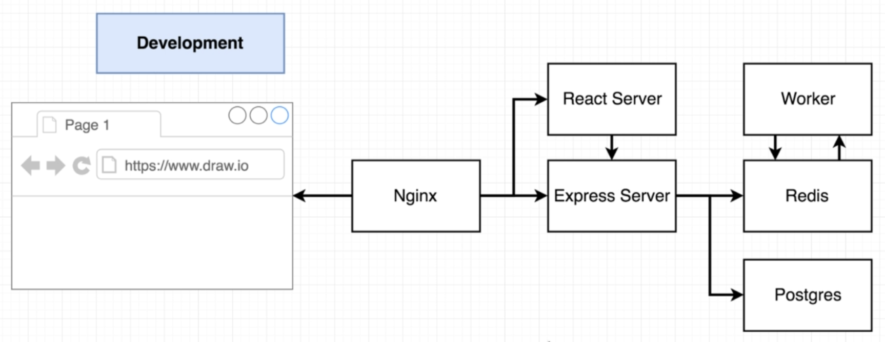
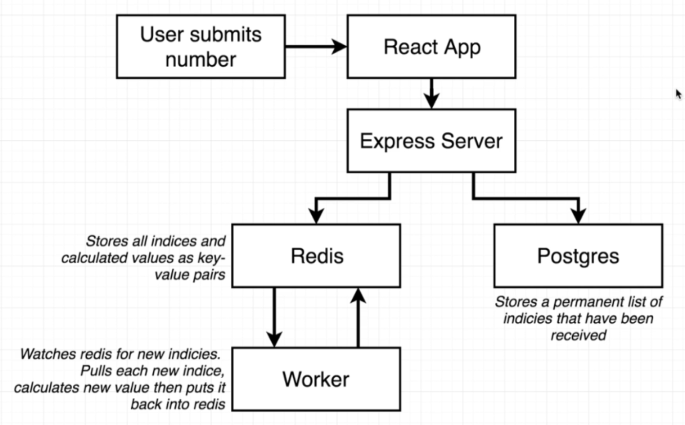
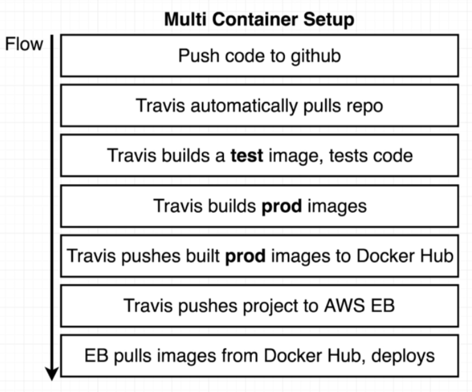
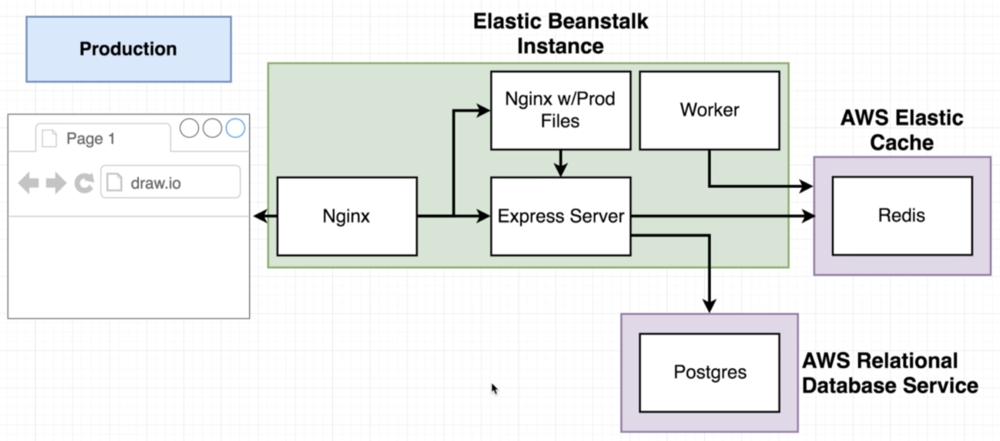

# Docker Multi-Container

We are using Amazon Elastic Beanstalk which uses Amazon Elastic Container Service (ECS)
To know more and to customize your ***Dockerrun.aws.json*** see the Documentation on [Task Definition](https://docs.aws.amazon.com/AmazonECS/latest/developerguide/task_definition_parameters.html#container_definitions)

### Fibonacci Sequence

### FrontEnd

### Data Storage

### Nginx

### BackEnd

### Data Flow

## Deployment Flow

